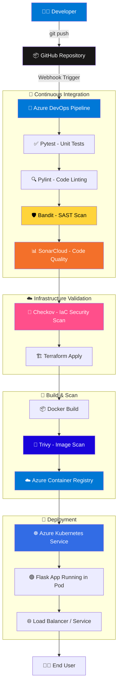
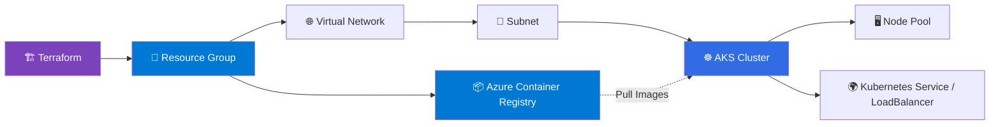
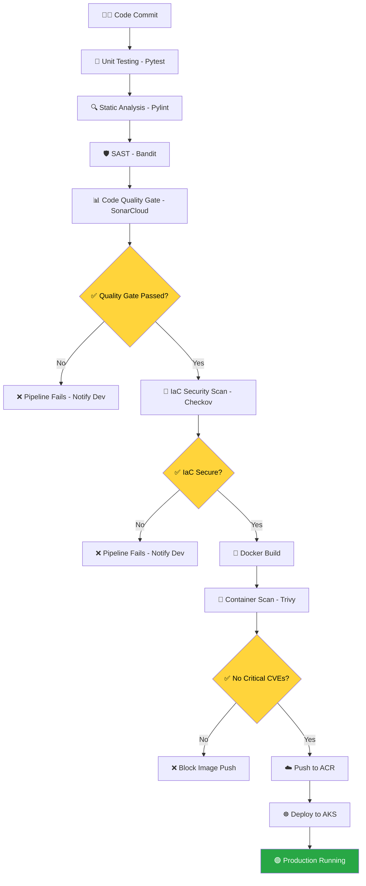
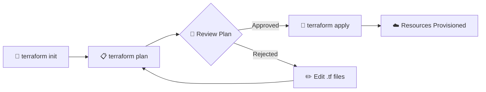
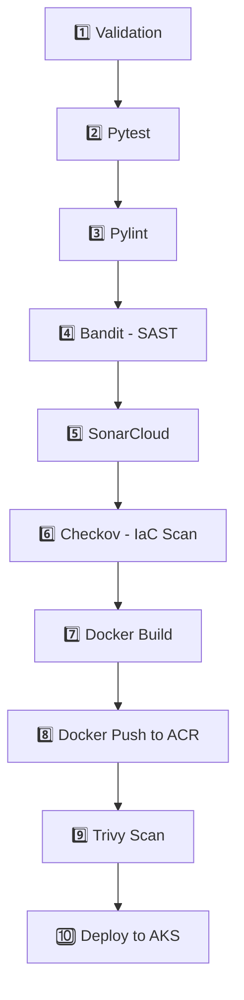
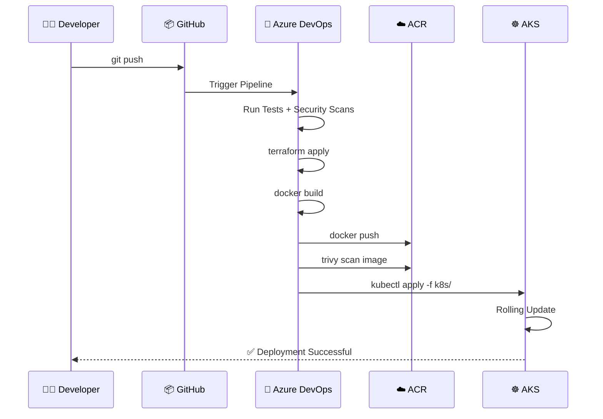

<div align="center">

# 🚀 Azure Enterprise DevSecOps Platform

### Production-Grade CI/CD Pipeline with Integrated Security, IaC, and Container Orchestration on AKS

*Shifting security left — from code commit to cloud deployment, every stage is automated, tested, and verified.*

<br>


<br>


</div>

<br>

---

## 📚 Table of Contents

1. [📋 Executive Summary](#-executive-summary)
2. [🏗️ Complete Architecture Diagram](#️-complete-architecture-diagram)
3. [🧰 Technology Stack](#-technology-stack)
4. [📁 Repository Structure](#-repository-structure)
5. [☁️ Infrastructure as Code](#️-infrastructure-as-code)
6. [🧩 Application Architecture](#-application-architecture)
7. [🔄 Complete CI/CD Pipeline](#-complete-cicd-pipeline)
8. [🛡️ DevSecOps Security Workflow](#️-devsecops-security-workflow)
9. [🚢 Azure Deployment Workflow](#-azure-deployment-workflow)
10. [⚙️ Installation Guide](#️-installation-guide)
11. [💻 Local Development Guide](#-local-development-guide)
12. [📸 Pipeline Screenshots](#-pipeline-screenshots)
13. [🐞 Error Resolution Log](#-error-resolution-log)
14. [🔐 Security Controls](#-security-controls)
15. [🏆 Project Achievements](#-project-achievements)
16. [🗺️ Future Roadmap](#️-future-roadmap)
17. [👤 Author](#-author)

---

## 📋 Executive Summary

### 🎯 Project Overview

The **Azure Enterprise DevSecOps Platform** is a fully automated, security-first CI/CD pipeline that takes a Python Flask application from a developer's `git push` all the way to a running pod on **Azure Kubernetes Service (AKS)** — with zero manual intervention.

Every commit triggers a pipeline that **tests, scans, and validates** the code, the dependencies, the Docker image, and the underlying Terraform infrastructure before anything is allowed to touch production.

### 💼 Business Objective

Modern enterprises can't afford to bolt security on at the end of the release cycle. This project demonstrates how to:

- ✅ Eliminate manual deployment errors through full automation
- ✅ Catch vulnerabilities **before** they reach production (Shift-Left Security)
- ✅ Enforce code quality gates on every single commit
- ✅ Provision cloud infrastructure repeatably and consistently using IaC
- ✅ Maintain a complete, auditable trail of every build, scan, and deployment

### 🤔 Why DevSecOps?

| Traditional DevOps | DevSecOps (This Project) |
|---|---|
| Security checked at the end | Security checked at **every stage** |
| Manual vulnerability scans | Automated SAST, IaC & container scanning |
| Infrastructure changes via Portal | Infrastructure managed as code (Terraform) |
| Slow, error-prone releases | Fast, repeatable, self-healing pipelines |
| Security = bottleneck | Security = built-in guardrail |

### 🏢 Enterprise Use Case

This pattern mirrors how real enterprise platform teams ship software: a developer opens a PR, the pipeline validates everything automatically, and only a fully-scanned, quality-approved container image is promoted to AKS. It's the same blueprint used by fintech, SaaS, and regulated industries that need **compliance + speed**.

---

## 🏗️ Complete Architecture Diagram

### 🔭 End-to-End System Architecture



### ☁️ Azure Infrastructure Diagram



### 🛡️ Security Flow Diagram



---

## 🧰 Technology Stack

### ☁️ Azure Services

| Service | Purpose |
|---|---|
| **Azure DevOps** | CI/CD orchestration — pipelines, repos, service connections |
| **Azure Container Registry (ACR)** | Private, secure storage for Docker images |
| **Azure Kubernetes Service (AKS)** | Managed Kubernetes for container orchestration |
| **Azure Resource Group** | Logical container for all provisioned resources |
| **Azure Virtual Network (VNet)** | Isolated network layer for AKS and supporting resources |

### 🏗️ Infrastructure & Containers

| Technology | Role |
|---|---|
| **Terraform** | Declarative IaC — provisions RG, VNet, AKS, ACR |
| **Docker** | Packages the Flask app into a portable, immutable image |
| **Kubernetes (AKS)** | Runs, scales, and self-heals the application containers |

### 🧪 Application & Quality

| Technology | Role |
|---|---|
| **Python** | Core application language |
| **Flask** | Lightweight web framework serving the application |
| **Pytest** | Automated unit testing framework |
| **Pylint** | Static code analysis / linting for code standards |

### 🛡️ Security Tooling

| Tool | Category | What It Catches |
|---|---|---|
| **Bandit** | SAST | Insecure Python code patterns (hardcoded secrets, unsafe `eval`, etc.) |
| **SonarCloud** | Code Quality / Security | Bugs, code smells, duplications, security hotspots |
| **Checkov** | IaC Security | Misconfigured Terraform resources (open ports, public storage, etc.) |
| **Trivy** | Container Security | CVEs in OS packages & dependencies inside Docker images |

---

## 📁 Repository Structure

```text
azure-devsecops-platform/
│
├── app/                          # 🐍 Application source code
│   ├── app.py                    # Main Flask application entry point
│   ├── requirements.txt          # Python dependencies
│   └── tests/                    # Pytest unit test suite
│       └── test_app.py
│
├── terraform/                    # 🏗️ Infrastructure as Code
│   ├── main.tf                   # Core resource definitions (RG, VNet, AKS, ACR)
│   ├── variables.tf              # Input variable declarations
│   ├── outputs.tf                # Exposed outputs (AKS name, ACR login server, etc.)
│   └── provider.tf               # Azure provider configuration
│
├── k8s/                          # ☸️ Kubernetes manifests
│   ├── deployment.yaml           # Pod / Deployment spec
│   └── service.yaml              # LoadBalancer / Service spec
│
├── Dockerfile                    # 🐳 Container build instructions
├── azure-pipelines.yml           # 🔧 Azure DevOps pipeline definition
├── sonar-project.properties      # 📊 SonarCloud configuration
└── README.md                     # 📖 You are here
```

---

## ☁️ Infrastructure as Code

All Azure infrastructure is provisioned declaratively with **Terraform** — no manual clicking in the Azure Portal.

| Resource | Purpose |
|---|---|
| **Resource Group** | Top-level logical container that groups every resource for this project, simplifying cost tracking and lifecycle management |
| **Virtual Network (VNet)** | Provides an isolated, private network space for the AKS cluster and its nodes |
| **Subnet** | Segments the VNet so AKS nodes get dedicated IP address space |
| **Azure Container Registry (ACR)** | Private registry that stores Docker images, integrated with AKS via managed identity for secure pulls |
| **AKS Cluster** | The managed Kubernetes control plane that schedules and runs the application |
| **Node Pool** | The underlying VM scale set that provides compute (CPU/RAM) to the AKS cluster |

### 🔁 Terraform Workflow



---

## 🧩 Application Architecture

### 🐍 Flask Application

A lightweight Python Flask app exposes one or more HTTP endpoints (e.g. `/` and `/health`), built specifically to be **container-friendly and stateless** — ideal for horizontal scaling on Kubernetes.

### 🐳 Dockerfile Explanation

The image is built using a slim Python base, copies in `requirements.txt` first (to leverage Docker layer caching), installs dependencies, then copies the application code — keeping the final image small and the build fast.

### 📦 requirements.txt

Pins exact dependency versions (Flask, Gunicorn, etc.) so builds are **reproducible** — the same versions are installed in CI, locally, and in the final container image.

### ☸️ Kubernetes Manifests

| File | Purpose |
|---|---|
| `deployment.yaml` | Defines the desired pod state — image, replicas, resource limits, liveness/readiness probes |
| `service.yaml` | Exposes the pods internally or externally via a `LoadBalancer` / `ClusterIP` service |

---

## 🔄 Complete CI/CD Pipeline

Every stage below runs **automatically** on every push to the main branch, in Azure DevOps.



| Stage | Tool | What Happens |
|---|---|---|
| **1. Validation** | Azure DevOps | Verifies repo structure, branch policies, triggers pipeline |
| **2. Unit Testing** | Pytest | Runs the test suite; fails the build on any failing test |
| **3. Linting** | Pylint | Enforces PEP8 and code style rules |
| **4. SAST** | Bandit | Scans Python source for insecure coding patterns |
| **5. Code Quality** | SonarCloud | Analyzes bugs, vulnerabilities, code smells; enforces Quality Gate |
| **6. IaC Security** | Checkov | Scans Terraform files for misconfigurations before `apply` |
| **7. Build** | Docker | Builds the application image from the Dockerfile |
| **8. Push** | ACR | Pushes the tagged image to Azure Container Registry |
| **9. Image Scan** | Trivy | Scans the built image for known CVEs in OS/library layers |
| **10. Deploy** | kubectl / AKS | Applies Kubernetes manifests, rolls out the new image |

---

## 🛡️ DevSecOps Security Workflow

```mermaid
flowchart LR
    Dev["👨‍💻 Developer"] --> Git["📦 GitHub"]
    Git --> ADO["🔧 Azure DevOps"]
    ADO --> Test["🧪 Testing - Pytest"]
    Test --> SAST["🛡️ SAST - Bandit"]
    SAST --> CQ["📊 Code Quality - SonarCloud"]
    CQ --> IaC["🔐 IaC Scan - Checkov"]
    IaC --> CS["🔎 Container Scan - Trivy"]
    CS --> Deploy["🚀 Deployment - AKS"]

    style SAST fill:#FFD43B,color:#000
    style CQ fill:#F3702A,color:#fff
    style IaC fill:#FF4F8B,color:#fff
    style CS fill:#1904DA,color:#fff
```



Security isn't a single gate — it's **layered** across the entire pipeline: code-level (Bandit), quality-level (SonarCloud), infrastructure-level (Checkov), and image-level (Trivy). A failure at *any* layer stops the pipeline before it reaches AKS.

---

## 🚢 Azure Deployment Workflow



---

## ⚙️ Installation Guide

### 1️⃣ Clone the Repository

```bash
git clone https://github.com/<your-username>/azure-devsecops-platform.git
cd azure-devsecops-platform
```

### 2️⃣ Azure Login

```bash
az login
az account set --subscription "<your-subscription-id>"
```

### 3️⃣ Provision Infrastructure with Terraform

```bash
cd terraform
terraform init
terraform plan -out=tfplan
terraform apply tfplan
```

### 4️⃣ Build & Push Docker Image

```bash
docker build -t <acr-name>.azurecr.io/devsecops-app:latest .
az acr login --name <acr-name>
docker push <acr-name>.azurecr.io/devsecops-app:latest
```

### 5️⃣ Configure kubectl for AKS

```bash
az aks get-credentials --resource-group <rg-name> --name <aks-cluster-name>
kubectl get nodes
```

### 6️⃣ Deploy to Kubernetes

```bash
kubectl apply -f k8s/deployment.yaml
kubectl apply -f k8s/service.yaml
kubectl get pods
kubectl get svc
```

### 7️⃣ Run the Azure DevOps Pipeline

Push to `main` — the pipeline defined in `azure-pipelines.yml` triggers automatically and runs every stage end-to-end.

---

## 💻 Local Development Guide

Run the Flask app locally without Docker or Azure, for fast iteration:

```bash
cd app
python -m venv venv
source venv/bin/activate        # Windows: venv\Scripts\activate
pip install -r requirements.txt
python app.py
```

Run tests locally before pushing:

```bash
pytest tests/ -v
pylint app.py
bandit -r .
```

Run the app in Docker locally:

```bash
docker build -t devsecops-app:local .
docker run -p 5000:5000 devsecops-app:local
```

---

## 📸 Pipeline Screenshots & Reports

> 🔗 Links to actual pipeline runs, scan reports, and dashboards — add your links below.

| Screenshot / Report | Link |
|---|---|
| ✅ Azure DevOps Pipeline — Successful Run | [Add link here]() |
| 📊 SonarCloud Dashboard | [Add link here]() |
| 🛡️ Bandit SAST Report | [Add link here]() |
| 🔐 Checkov IaC Scan Report | [Add link here]() |
| 🔎 Trivy Container Scan Report | [Add link here]() |
| 🐳 Docker Build Output | [Add link here]() |
| 📦 Azure Container Registry — Pushed Image | [Add link here]() |
| ☸️ AKS — Application Running | [Add link here]() |
| 🏗️ Terraform Apply Output | [Add link here]() |

---

## 🐞 Error Resolution Log

Real issues hit during implementation — documented for transparency and future reference.

### 1️⃣ Docker Daemon Error
- **Error:** `Cannot connect to the Docker daemon at unix:///var/run/docker.sock`
- **Root Cause:** Docker service wasn't running on the build agent
- **Resolution:** Started the Docker service (`sudo systemctl start docker`) and verified agent permissions
- **Lesson:** Always verify the build agent's Docker daemon status before debugging the pipeline YAML itself

### 2️⃣ Trivy Installation Error
- **Error:** `trivy: command not found` on the pipeline agent
- **Root Cause:** Trivy wasn't installed on the hosted agent image
- **Resolution:** Added an explicit install step (`curl`-based install script) before the scan step
- **Lesson:** Hosted agents don't come with every security tool pre-installed — install explicitly

### 3️⃣ Trivy Authentication Error
- **Error:** `unauthorized: authentication required` when scanning the ACR image
- **Root Cause:** Trivy wasn't authenticated against the private ACR
- **Resolution:** Used `az acr login` / passed registry credentials to Trivy before scanning
- **Lesson:** Private registries need explicit auth for scanning tools, not just for `docker push`

### 4️⃣ SonarCloud Automatic Analysis Conflict
- **Error:** `Automatic Analysis is enabled — pipeline-based analysis conflicts`
- **Root Cause:** SonarCloud's built-in Automatic Analysis was still toggled on for the project
- **Resolution:** Disabled Automatic Analysis in SonarCloud project settings to allow CI-based analysis
- **Lesson:** When using a CI-integrated SonarCloud task, always disable Automatic Analysis first

### 5️⃣ SonarCloud Task Version Mismatch
- **Error:** Pipeline failed on an unsupported `SonarCloudPrepare@1` task version
- **Root Cause:** Marketplace task version mismatch with the pipeline YAML schema
- **Resolution:** Updated to the correct task version and matching organization/project keys
- **Lesson:** Pin task versions explicitly to avoid silent breaking changes

### 6️⃣ Checkov Exit Code 1
- **Error:** Pipeline failed immediately after the Checkov step
- **Root Cause:** Checkov exits with code 1 by default when *any* check fails — even low-severity ones
- **Resolution:** Reviewed flagged checks, fixed real misconfigurations, and used `--soft-fail` only where justified
- **Lesson:** Don't blanket-suppress IaC scan failures — triage each finding individually

### 7️⃣ Git SSH Configuration Issue
- **Error:** `Permission denied (publickey)` when pushing to GitHub
- **Root Cause:** SSH key wasn't added to the local SSH agent / GitHub account
- **Resolution:** Generated a new SSH key pair, added the public key to GitHub, loaded it via `ssh-add`
- **Lesson:** Always verify `ssh -T git@github.com` before assuming the remote/repo config is the problem

### 8️⃣ Azure DevOps Service Connection Error
- **Error:** `No service connection found` when the pipeline tried to authenticate to Azure
- **Root Cause:** Service connection wasn't authorized for the pipeline/project
- **Resolution:** Recreated the Azure Resource Manager service connection and granted pipeline-level permission
- **Lesson:** Service connections need explicit project-level authorization, not just creation

---

## 🔐 Security Controls

| Control | Tool | Layer | Description |
|---|---|---|---|
| **SAST** | Bandit | Source Code | Flags insecure coding patterns directly in Python source before it's even built |
| **Code Quality & Security Hotspots** | SonarCloud | Source Code | Continuous inspection for bugs, vulnerabilities, duplicated code, and maintainability issues |
| **IaC Security** | Checkov | Infrastructure | Scans Terraform `.tf` files for misconfigured cloud resources before they're provisioned |
| **Container Security** | Trivy | Image | Scans the final Docker image's OS packages and dependencies for known CVEs |
| **Kubernetes Validation** | kubectl / manifests | Deployment | Ensures manifests are syntactically valid and resource limits are defined before rollout |

---

## 🏆 Project Achievements

✅ Terraform-provisioned Azure infrastructure (RG, VNet, AKS, ACR)
✅ Fully containerized Flask application
✅ Automated image push to Azure Container Registry
✅ Production-style deployment to Azure Kubernetes Service
✅ End-to-end Azure DevOps CI/CD pipeline
✅ Automated unit testing with Pytest
✅ Continuous code quality analysis with SonarCloud
✅ Linting enforcement with Pylint
✅ Static Application Security Testing with Bandit
✅ Infrastructure-as-Code security scanning with Checkov
✅ Container vulnerability scanning with Trivy
✅ Fully automated, zero-manual-step AKS deployment

---

## 🗺️ Future Roadmap

Planned enterprise-grade enhancements to extend this platform further:

- ⏳ **Prometheus** — metrics collection for cluster and application observability
- ⏳ **Grafana** — real-time dashboards for monitoring pipeline & infrastructure health
- ⏳ **ArgoCD** — GitOps-based continuous delivery for AKS
- ⏳ **Helm** — package and template Kubernetes manifests for multi-environment deployments
- ⏳ **Azure Key Vault** — centralized secrets management, removing hardcoded credentials
- ⏳ **OWASP Dependency Check** — additional software composition analysis (SCA) layer
- ⏳ **Azure Monitor** — native Azure observability and alerting integration
- ⏳ **Microsoft Defender for Cloud** — continuous cloud security posture management (CSPM)

> Items will be marked ✅ **Completed** here as they're implemented.

---

## 👤 Author

<div align="center">

**Your Name**

[](https://github.com/your-username)
[](https://linkedin.com/in/your-profile)
[](mailto:your-email@example.com)

*Built with ☁️ Azure, 🐳 Docker, ☸️ Kubernetes, and a lot of 🐞 debugging.*

</div>

---

<div align="center">

⭐ **If this project helped you understand DevSecOps better, consider giving it a star!** ⭐

</div>
